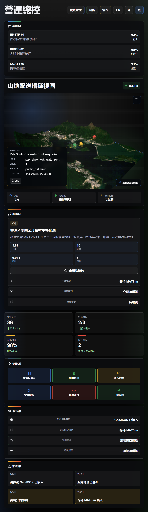

# Brianstormmm Frontend Command Center

<p align="center">
  <a href="docs/original-brainstorm-readme.md"></a>
</p>

<p align="center">
  <a href="#traditional-chinese"><kbd>繁體中文</kbd></a>
  <a href="#simplified-chinese"><kbd>简体中文</kbd></a>
  <a href="#english"><kbd>English</kbd></a>
</p>



<p align="center">
  <a href="https://itsuav.github.io/Brianstormmm/"></a>
</p>

<a id="traditional-chinese"></a>

## 繁體中文

<p align="center">
  <a href="#traditional-chinese"><kbd>繁體中文</kbd></a>
  <a href="#simplified-chinese"><kbd>简体中文</kbd></a>
  <a href="#english"><kbd>English</kbd></a>
</p>

### 專案定位

Brianstormmm Frontend Command Center 是 ITSuav 無人機配送專案的前端總控大屏。當前版本聚焦香港科學園與山地配送場景，提供一個可展示、可維護、可後續接入演算法與後端 API 的 React 前端。

原始 Brainstorm 方案已保留在 [docs/original-brainstorm-readme.md](docs/original-brainstorm-readme.md)。上方 badge 按鈕可直接跳轉。

### 目前狀態

- 前端：React + TypeScript + Vite 已完成。
- 中央視圖：Three.js 互動式 3D local scene，支援滑鼠拖曳、滾輪縮放、受限平移與一定角度內的環繞旋轉。
- 地理資料：由真實 Google Earth Engine 資料生成香港區域地形與衛星影像。
- Blender 資產：由 GEE 高程圖與 Sentinel-2 紋理生成真實渲染圖與 GLB。
- 路線規劃：保留為演算法組接入口，目前不把前端展示路線宣稱為已驗證航線。
- MATSim：保留為後續模擬團隊接入口，目前前端只展示協作槽位。
- 大屏數字：目前為前端展示佔位資料，待取得公司資料 API 後替換為即時動態資料。

### 快速開啟

全隊可直接開啟 GitHub Pages 版本：

```text
https://itsuav.github.io/Brianstormmm/
```

本機開發與調試可使用桌面快捷方式：

桌面已建立快捷方式：

```text
C:\Users\Judy\Desktop\Brianstormmm Frontend.lnk
```

等效命令：

```powershell
Set-Location 'D:\ITSuav\Brianstormmm'
npm run open
```

手動啟動：

```powershell
Set-Location 'D:\ITSuav\Brianstormmm'
npm install
npm run dev -- --host 127.0.0.1 --port 5174
```

瀏覽器開啟：

```text
http://127.0.0.1:5174/?v=latest
```

### 前端技術亮點

- 大屏風格是營運總控，而不是行銷 landing page。
- 預設繁體中文，並支援 English / 简体中文 / 繁體中文切換。
- 使用 Google 風格藍、綠、黃、紅作為操作狀態點綴，但避免繁雜彩條。
- 中央 3D 地形由真實 GEE DEM 在瀏覽器端取樣生成，並覆蓋 Sentinel-2 真彩色影像。
- `src/components/DigitalTwinViewport.tsx` 使用 Three.js + OrbitControls 實現 local scene 互動。
- `src/domain/models.ts` 定義無人機、航線、任務、資產與指標的 TypeScript 邊界。
- `src/data/assetRegistry.ts` 區分已生成真實資產、未來必需官方資料與暫時 blocked 的展示層。

### 資料來源

GEE 腳本：`scripts/export_gee_assets.py`

目前使用：

- `COPERNICUS/DEM/GLO30`：30 m DEM，高程來源。
- `COPERNICUS/S2_SR_HARMONIZED`：Sentinel-2 地表反射率，真彩色衛星紋理。
- `JRC/GSW1_4/GlobalSurfaceWater`：水體 occurrence，作為風險篩查輸入之一。
- `ee.Terrain.slope(COPERNICUS/DEM/GLO30)`：坡度圖層。
- Sentinel-2 `B8` 與 `B4` 計算 NDVI：植被風險篩查。

生成檔案：

- `public/assets/geospatial/hk-gee-dem-heightmap.png`
- `public/assets/geospatial/hk-gee-sentinel2-texture.png`
- `public/assets/geospatial/hk-gee-slope.png`
- `public/assets/geospatial/hk-gee-risk-surface.png`
- `public/assets/geospatial/manifest.json`
- `public/assets/drone-twin/hkstp/hk-gee-blender-terrain.png`
- `public/assets/drone-twin/hkstp/hk-gee-terrain-model.glb`
- `public/assets/drone-twin/hkstp/blender-manifest.json`

限制：這些資料適合前端展示與區域級篩查，不是航空級工程資料。正式營運仍需官方建築高度、禁飛區、障礙物、天氣與公司內部營運 API。

### 前端維護方案

常用位置：

- 主要版面：`src/App.tsx`
- 大屏樣式：`src/App.css`
- 全域樣式：`src/index.css`
- 中央 3D 視圖：`src/components/DigitalTwinViewport.tsx`
- 三語文案：`src/i18n/translations.ts`
- 目前佔位營運資料：`src/data/commandCenterData.ts`
- 資產路徑與狀態：`src/data/assetRegistry.ts`
- 共享型別：`src/domain/models.ts`

日常檢查：

```powershell
npm run assets:verify
npm run build
npm run lint
```

更新文案時，請同步英文、简体中文、繁體中文。營運大屏上不要直接展示 GEE、Blender、GLB、manifest、prompt 等技術詞，除非新增的是開發者診斷頁。

### 演算法與後端接入方案

建議不要讓 React 元件直接呼叫原始 API，而是在 `src/services/` 建立資料服務與 adapter：

```text
src/services/httpClient.ts
src/services/operationsApi.ts
src/services/fleetTelemetryApi.ts
src/services/routePlanningApi.ts
src/services/matsimApi.ts
src/services/geospatialApi.ts
```

後端或演算法輸出應先轉換成 `src/domain/models.ts` 中的型別，再交給 UI。

路線規劃輸出應對應 `DroneRouteCandidate`：

```json
{
  "id": "route-2026-001",
  "name": "HKSTP to delivery site",
  "status": "candidate",
  "source": "algorithm_interface",
  "distanceKm": 12.4,
  "estimatedMinutes": 18,
  "riskScore": 0.31,
  "waypoints": [
    {
      "sequence": 1,
      "action": "launch",
      "label": "HKSTP launch deck",
      "latitude": 22.4269,
      "longitude": 114.2122,
      "altitudeMeters": 18
    }
  ]
}
```

MATSim 第一階段建議只傳營運摘要，不把模擬器內部細節搬到大屏：scenario ID、run status、time window、demand set、network reference、KPI comparison、recommended dispatch window。

即時資料可按後端能力選擇 polling、Server-Sent Events 或 WebSocket。無人機私有遙測與控制通道不應由瀏覽器直接連接，應經後端 gateway。

---

<a id="simplified-chinese"></a>

## 简体中文

<p align="center">
  <a href="#traditional-chinese"><kbd>繁體中文</kbd></a>
  <a href="#simplified-chinese"><kbd>简体中文</kbd></a>
  <a href="#english"><kbd>English</kbd></a>
</p>

### 项目定位

Brianstormmm Frontend Command Center 是 ITSuav 无人机配送项目的前端总控大屏。当前版本聚焦香港科学园与山地配送场景，提供一个可展示、可维护、可后续接入算法与后端 API 的 React 前端。

原始 Brainstorm 方案已保留在 [docs/original-brainstorm-readme.md](docs/original-brainstorm-readme.md)。页面顶部的 badge 按钮可直接跳转。

### 当前状态

- 前端：React + TypeScript + Vite 已完成。
- 中央视图：Three.js 交互式 3D local scene，支持鼠标拖拽、滚轮缩放、受限平移与一定角度内的环绕旋转。
- 地理数据：由真实 Google Earth Engine 数据生成香港区域地形与卫星影像。
- Blender 资产：由 GEE 高程图与 Sentinel-2 纹理生成真实渲染图与 GLB。
- 路线规划：保留为算法组接入口，目前不把前端展示路线宣称为已验证航线。
- MATSim：保留为后续仿真团队接入口，目前前端只展示协作槽位。
- 大屏数字：目前为前端展示占位数据，待取得公司数据 API 后替换为实时动态数据。

### 快速打开

全队可直接打开 GitHub Pages 版本：

```text
https://itsuav.github.io/Brianstormmm/
```

本机开发与调试可使用桌面快捷方式：

桌面已创建快捷方式：

```text
C:\Users\Judy\Desktop\Brianstormmm Frontend.lnk
```

等效命令：

```powershell
Set-Location 'D:\ITSuav\Brianstormmm'
npm run open
```

手动启动：

```powershell
Set-Location 'D:\ITSuav\Brianstormmm'
npm install
npm run dev -- --host 127.0.0.1 --port 5174
```

浏览器打开：

```text
http://127.0.0.1:5174/?v=latest
```

### 前端技术亮点

- 大屏风格是运营总控，而不是营销 landing page。
- 默认繁体中文，并支持 English / 简体中文 / 繁體中文切换。
- 使用 Google 风格蓝、绿、黄、红作为操作状态点缀，但避免繁杂彩条。
- 中央 3D 地形由真实 GEE DEM 在浏览器端采样生成，并覆盖 Sentinel-2 真彩色影像。
- `src/components/DigitalTwinViewport.tsx` 使用 Three.js + OrbitControls 实现 local scene 交互。
- `src/domain/models.ts` 定义无人机、航线、任务、资产与指标的 TypeScript 边界。
- `src/data/assetRegistry.ts` 区分已生成真实资产、未来必需官方数据与暂时 blocked 的展示层。

### 数据源

GEE 脚本：`scripts/export_gee_assets.py`

目前使用：

- `COPERNICUS/DEM/GLO30`：30 m DEM，高程来源。
- `COPERNICUS/S2_SR_HARMONIZED`：Sentinel-2 地表反射率，真彩色卫星纹理。
- `JRC/GSW1_4/GlobalSurfaceWater`：水体 occurrence，作为风险筛查输入之一。
- `ee.Terrain.slope(COPERNICUS/DEM/GLO30)`：坡度图层。
- Sentinel-2 `B8` 与 `B4` 计算 NDVI：植被风险筛查。

生成文件：

- `public/assets/geospatial/hk-gee-dem-heightmap.png`
- `public/assets/geospatial/hk-gee-sentinel2-texture.png`
- `public/assets/geospatial/hk-gee-slope.png`
- `public/assets/geospatial/hk-gee-risk-surface.png`
- `public/assets/geospatial/manifest.json`
- `public/assets/drone-twin/hkstp/hk-gee-blender-terrain.png`
- `public/assets/drone-twin/hkstp/hk-gee-terrain-model.glb`
- `public/assets/drone-twin/hkstp/blender-manifest.json`

限制：这些数据适合前端展示与区域级筛查，不是航空级工程数据。正式运营仍需官方建筑高度、禁飞区、障碍物、天气与公司内部运营 API。

### 前端维护方案

常用位置：

- 主要版面：`src/App.tsx`
- 大屏样式：`src/App.css`
- 全局样式：`src/index.css`
- 中央 3D 视图：`src/components/DigitalTwinViewport.tsx`
- 三语文案：`src/i18n/translations.ts`
- 当前占位运营数据：`src/data/commandCenterData.ts`
- 资产路径与状态：`src/data/assetRegistry.ts`
- 共享类型：`src/domain/models.ts`

日常检查：

```powershell
npm run assets:verify
npm run build
npm run lint
```

更新文案时，请同步英文、简体中文、繁体中文。运营大屏上不要直接展示 GEE、Blender、GLB、manifest、prompt 等技术词，除非新增的是开发者诊断页。

### 算法与后端接入方案

建议不要让 React 组件直接调用原始 API，而是在 `src/services/` 建立数据服务与 adapter：

```text
src/services/httpClient.ts
src/services/operationsApi.ts
src/services/fleetTelemetryApi.ts
src/services/routePlanningApi.ts
src/services/matsimApi.ts
src/services/geospatialApi.ts
```

后端或算法输出应先转换成 `src/domain/models.ts` 中的类型，再交给 UI。

路线规划输出应对应 `DroneRouteCandidate`。允许状态包括：`algorithm_pending`、`candidate`、`approved`、`active`。

MATSim 第一阶段建议只传运营摘要，不把仿真器内部细节搬到大屏：scenario ID、run status、time window、demand set、network reference、KPI comparison、recommended dispatch window。

实时数据可按后端能力选择 polling、Server-Sent Events 或 WebSocket。无人机私有遥测与控制通道不应由浏览器直接连接，应经后端 gateway。

---

<a id="english"></a>

## English

<p align="center">
  <a href="#traditional-chinese"><kbd>繁體中文</kbd></a>
  <a href="#simplified-chinese"><kbd>简体中文</kbd></a>
  <a href="#english"><kbd>English</kbd></a>
</p>

### Project Positioning

Brianstormmm Frontend Command Center is the frontend operations dashboard for the ITSuav drone delivery project. The current version focuses on an HKSTP and mountain-delivery scenario, providing a presentable and maintainable React frontend that can later connect to algorithm and backend APIs.

The original Brainstorm project README is preserved at [docs/original-brainstorm-readme.md](docs/original-brainstorm-readme.md). The badge button at the top links to it directly.

### Current Status

- Frontend: React + TypeScript + Vite is implemented.
- Central view: interactive Three.js 3D local scene with mouse drag, wheel zoom, bounded pan, and constrained orbit rotation.
- Geospatial data: real Hong Kong regional terrain and satellite imagery generated from Google Earth Engine.
- Blender assets: real render and GLB generated from the GEE heightmap and Sentinel-2 texture.
- Route planning: reserved for the algorithm team; the frontend does not claim displayed routes are validated flight routes.
- MATSim: reserved for the simulation team; the current UI only shows the collaboration slot.
- Dashboard numbers: current values are frontend placeholders and should become live values after company data APIs are available.

### Quick Start

The full team can open the hosted GitHub Pages version directly:

```text
https://itsuav.github.io/Brianstormmm/
```

For local development and debugging, use the desktop shortcut on this workstation:

A desktop shortcut has been created on this workstation:

```text
C:\Users\Judy\Desktop\Brianstormmm Frontend.lnk
```

Equivalent command:

```powershell
Set-Location 'D:\ITSuav\Brianstormmm'
npm run open
```

Manual development start:

```powershell
Set-Location 'D:\ITSuav\Brianstormmm'
npm install
npm run dev -- --host 127.0.0.1 --port 5174
```

Open:

```text
http://127.0.0.1:5174/?v=latest
```

### Frontend Technical Highlights

- The UI is an operations dashboard, not a marketing landing page.
- Default locale is Traditional Chinese, with English / Simplified Chinese / Traditional Chinese switching.
- Google-inspired blue, green, yellow, and red accents indicate operational states without noisy striping.
- The central 3D terrain is generated in-browser from a real GEE DEM and draped with a Sentinel-2 true-color texture.
- `src/components/DigitalTwinViewport.tsx` implements the local-scene interaction using Three.js + OrbitControls.
- `src/domain/models.ts` defines TypeScript boundaries for drones, routes, tasks, assets, and metrics.
- `src/data/assetRegistry.ts` separates generated real assets, future required official datasets, and currently blocked visualization layers.

### Data Sources

GEE script: `scripts/export_gee_assets.py`

Current datasets:

- `COPERNICUS/DEM/GLO30`: 30 m DEM elevation source.
- `COPERNICUS/S2_SR_HARMONIZED`: Sentinel-2 surface reflectance true-color satellite texture.
- `JRC/GSW1_4/GlobalSurfaceWater`: water occurrence as one screening-risk input.
- `ee.Terrain.slope(COPERNICUS/DEM/GLO30)`: terrain slope layer.
- NDVI from Sentinel-2 `B8` and `B4`: vegetation screening input.

Generated files:

- `public/assets/geospatial/hk-gee-dem-heightmap.png`
- `public/assets/geospatial/hk-gee-sentinel2-texture.png`
- `public/assets/geospatial/hk-gee-slope.png`
- `public/assets/geospatial/hk-gee-risk-surface.png`
- `public/assets/geospatial/manifest.json`
- `public/assets/drone-twin/hkstp/hk-gee-blender-terrain.png`
- `public/assets/drone-twin/hkstp/hk-gee-terrain-model.glb`
- `public/assets/drone-twin/hkstp/blender-manifest.json`

Limitations: these datasets are suitable for frontend visualization and regional screening, not aviation-grade engineering operations. Production operations still require official building heights, no-fly zones, obstacle data, weather feeds, and company operations APIs.

### Frontend Maintenance Plan

Common edit locations:

- Main layout: `src/App.tsx`
- Dashboard styling: `src/App.css`
- Global styles: `src/index.css`
- Central 3D view: `src/components/DigitalTwinViewport.tsx`
- Trilingual copy: `src/i18n/translations.ts`
- Current placeholder operations data: `src/data/commandCenterData.ts`
- Asset paths and readiness state: `src/data/assetRegistry.ts`
- Shared types: `src/domain/models.ts`

Routine checks:

```powershell
npm run assets:verify
npm run build
npm run lint
```

When updating copy, keep English, Simplified Chinese, and Traditional Chinese synchronized. Do not expose GEE, Blender, GLB, manifest, prompt, or similar implementation terms on the operator-facing dashboard unless a developer diagnostics page is intentionally added.

### Algorithm And Backend Integration Plan

Do not let React components call raw APIs directly. Add typed services and adapters under `src/services/`:

```text
src/services/httpClient.ts
src/services/operationsApi.ts
src/services/fleetTelemetryApi.ts
src/services/routePlanningApi.ts
src/services/matsimApi.ts
src/services/geospatialApi.ts
```

Backend or algorithm output should be converted into the models in `src/domain/models.ts` before reaching the UI.

Route planner output should map to `DroneRouteCandidate`. Allowed statuses are `algorithm_pending`, `candidate`, `approved`, and `active`.

For MATSim, the first integration should provide operations-level summaries rather than raw simulator internals: scenario ID, run status, time window, demand set, network reference, KPI comparison, and recommended dispatch window.

For live data, choose polling, Server-Sent Events, or WebSocket based on backend capability. Private drone telemetry and control channels should go through a backend gateway, not directly from the browser.

## Verification

```powershell
npm run assets:verify
npm run build
npm run lint
```

Before pushing, verify that `.env`, `node_modules/`, `dist/`, service-account JSON files, private tokens, and API keys are not staged.
